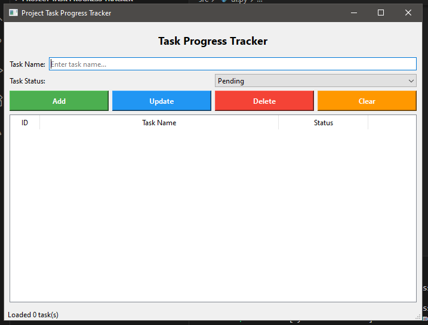

# Project Task Progress Tracker

## Proponent(s)
Christian Jay G Baleña - BSCS

## Project Overview
This is a simple task management application that helps users organize and track their project tasks efficiently. It allows users to create, update, delete, and view tasks with different status levels (Pending, In Progress, Completed). The application was developed using Python and PyQt6 for the graphical user interface, with SQLite database for persistent data storage. It provides a clean and beginner-friendly interface suitable for students and professionals managing their daily tasks.

## Features
● Add, edit, and delete task records  
● Store and retrieve data using SQLite database  
● Display tasks in an organized table view  
● Color-coded status indicators for easy tracking  
● Simple and intuitive user interface  
● Persistent data storage across sessions

## Code Design and Structure

The project follows a modular and organized structure to ensure maintainability and readability:

**Project Structure:**
```
Project task progress tracker/
│
├── main.py                 # Main program - Entry point to run the application
├── src/                    # Source code package containing core modules
│   ├── __init__.py        # Package initializer
│   ├── database.py        # Database operations and SQLite CRUD functions
│   └── ui.py              # User interface components and window design
│
├── tasks.db               # SQLite database file (auto-generated)
└── README.md              # Project documentation
```

**Code Organization:**
- **main.py** – Contains the main program that initializes and runs the application
- **src/database.py** – Handles all database operations (Create, Read, Update, Delete)
- **src/ui.py** – Manages the graphical user interface and user interactions
- **Naming conventions** – Uses camelCase for variables (e.g., taskName, statusInput)
- **Comments** – Clear and concise comments throughout the code for easy understanding
- **Error handling** – Try-except blocks to handle errors gracefully

## Screenshots

**Main Interface:**



*The application features a clean, intuitive interface with input fields for task name and status, action buttons (Add, Update, Delete, Clear), and a table displaying all tasks with their IDs, names, and status indicators.*

## How to Run the Program

Follow these steps to execute the project:

1. **Make sure Python 3.x is installed**  
   - Check by running: `python --version`

2. **Install required libraries**  
   - Open terminal in the project folder
   - Run: `pip install PyQt6`

3. **Open the project folder** in an IDE (VS Code, PyCharm) or terminal

4. **Run the main file**  
   ```bash
   python main.py
   ```

5. The application window will open and you can start managing your tasks!

---

## Additional Information

### Requirements
- Python 3.8 or higher
- PyQt6 library
- SQLite (built-in with Python)

### Database Schema
**Table: tasks**
| Column | Type | Description |
|--------|------|-------------|
| id | INTEGER | Primary key (auto-increment) |
| name | TEXT | Task name (required) |
| status | TEXT | Task status (Pending/In Progress/Completed) |

### Notes
- The database file (`tasks.db`) is automatically created on first run
- All tasks are stored permanently and persist between sessions
- Code follows clean architecture with separation of concerns
- Suitable for Computer Science students learning GUI development and database integration
